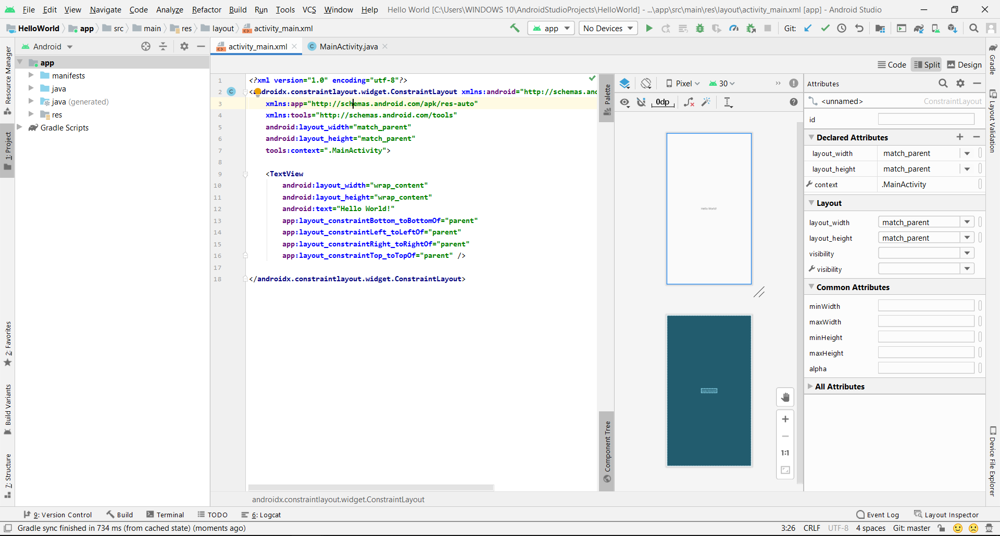

# 01 - Hello World

## Tujuan Pembelajaran

1. Mahasiswa mampu menyelesaikan soal Kuis 1 MIT App Inventor 
2. Mahasiswa mampu menginstall Android Studio, Android SDK, dan konfigurasi Kotlin 
3. Mahasiswa Mampu menginstall Emulator 
4. Mahasiswa Mampu Menghubungkan Perangkat Mobile Ke Komputer / Laptop 
5. Mahasiswa mampu melakukan instalasi Git dan mengkonfigurasikannya  di Android Studio

## Hasil Praktikum

