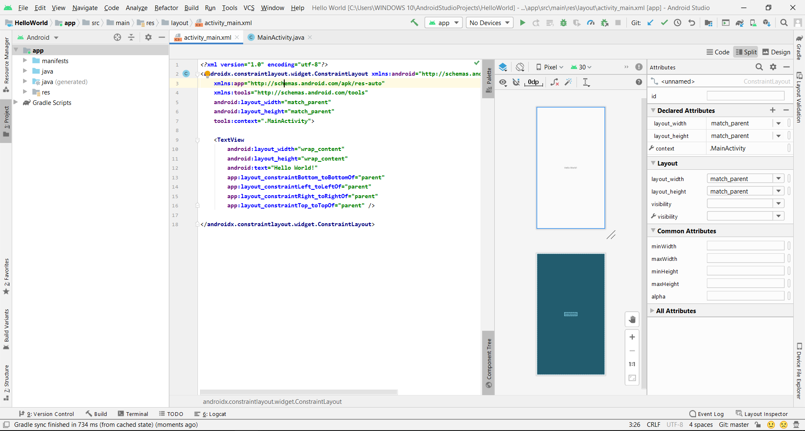

# 01 - Hello World

## Tujuan Pembelajaran

1. Mahasiswa mampu menginstall Android Studio, Android SDK, dan konfigurasi Kotlin 
2. Mahasiswa Mampu menginstall Emulator 
3. Mahasiswa Mampu Menghubungkan Perangkat Mobile Ke Komputer / Laptop 
4. Mahasiswa mampu melakukan instalasi Git dan mengkonfigurasikannya  di Android Studio

## Hasil Praktikum

## Pernyataan Diri

Saya menyatakan isi tugas, kode program, dan laporan praktikum ini dibuat oleh saya sendiri. Saya tidak melakukan plagiasi, kecurangan, menyalin/menggandakan milik orang lain.

Jika saya melakukan plagiasi, kecurangan, atau melanggar hak kekayaan intelektual, saya siap untuk mendapat sanksi atau hukuman sesuai peraturan perundang-undangan yang berlaku.

Ttd,

***(Ika Lailatuzzahro)***

