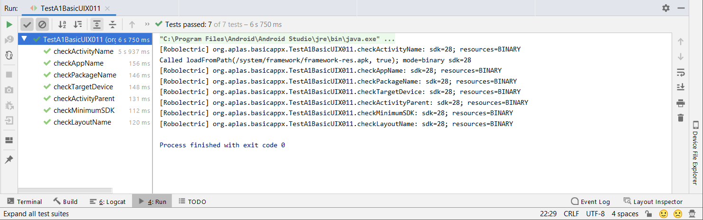
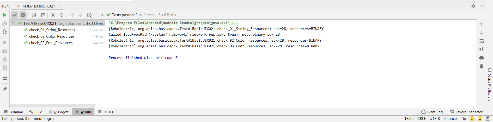
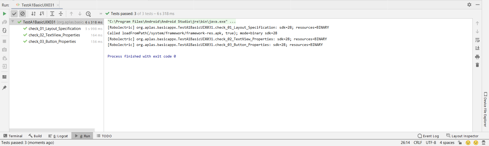
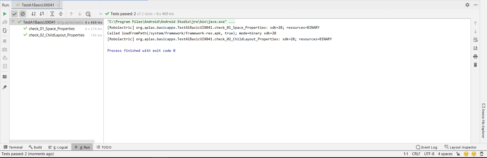
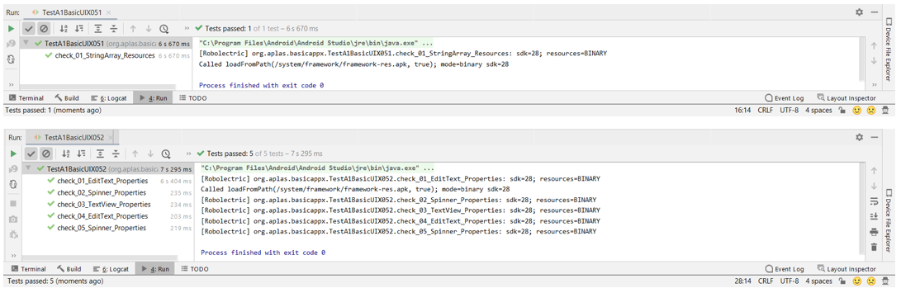
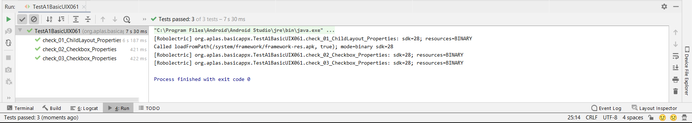
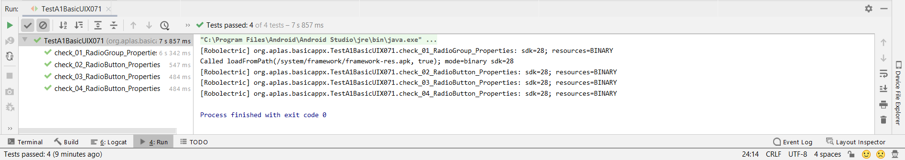
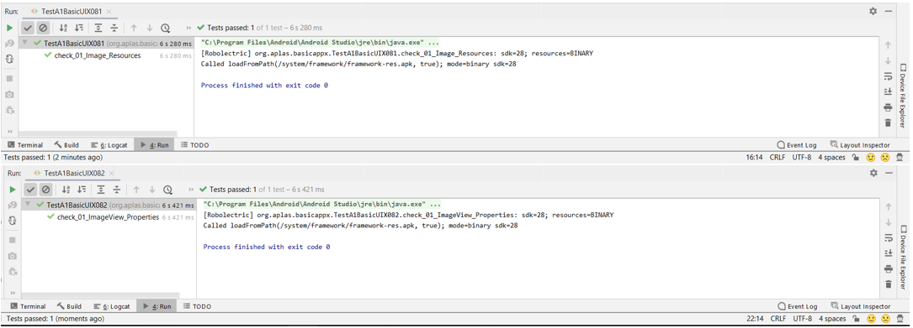
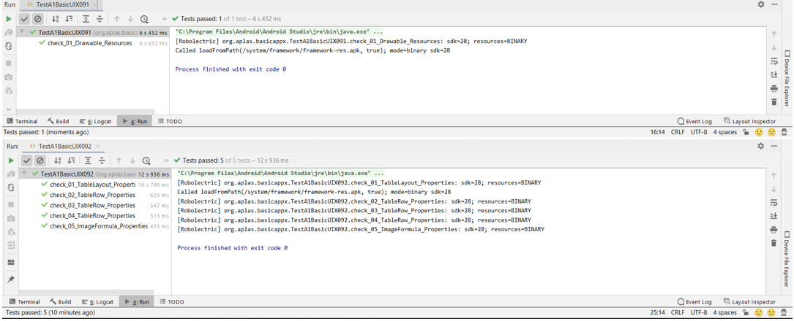

# 02 - BasicAPPX(Aplas A1)

## Tujuan Pembelajaran

1. Mahasiswa memahami konsep layout pada android. 
2. Mahasiswa memahami konsep View Group dan Hierarchy pada layout. 
3. Mahasiswa mampu membuat layout sederhana. 
4. Mahasiswa menguasai layout editor dan kegunaannya pada android studio

## Hasil Praktikum

1. Guide 1 (BasicAppX011)

2. Guide  2 (BasicAPPX021)

3. Guide  3 (BasicAPPX031)

4. Guide  4 (BasicAPPX041)

5. Guide  5 (BasicAPPX051)

6. Guide  6 (BasicAPPX061)

7. Guide  7 (BasicAPPX071)

8. Guide  8 (BasicAPPX081)

9. Guide  9 (BasicAPPX091)

## Pernyataan Diri

Saya menyatakan isi tugas, kode program, dan laporan praktikum ini dibuat oleh saya sendiri. Saya tidak melakukan plagiasi, kecurangan, menyalin/menggandakan milik orang lain.

Jika saya melakukan plagiasi, kecurangan, atau melanggar hak kekayaan intelektual, saya siap untuk mendapat sanksi atau hukuman sesuai peraturan perundang-undangan yang berlaku.

Ttd,

***(Ika Lailatuzzahro)*** 