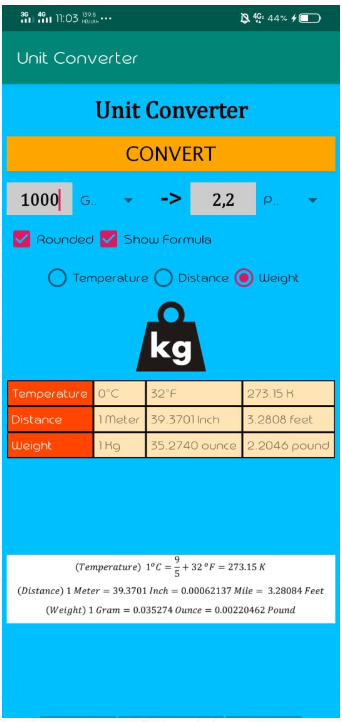

# 03 - Aplas B1

## Tujuan Pembelajaran

1. Mahasiswa mampu melakukan pengujian, debugging, dan menggunakan pustaka dukungan. 
2. Mahasiswa mampu memodifikasi program kalkulator sederhana menjadi aplikasi yang layak digunakan.

## Hasil Praktikum

1. Guide 1 (B1X.01)

2. Guide  2 (B1X.02)

3. Guide  3 (B1X.03)

4. Guide  4 (B1X.04)

5. Guide  5 (B1X.05)

6. Guide  6 (B1X.06)

7. Guide  7 (B1X.07)

8. Guide  8 (B1X.08)

9. Guide  9 (B1X.09)

Hasil

Hasil Temperature

Hasil Distance

Hasil Weight

## Pernyataan Diri

Saya menyatakan isi tugas, kode program, dan laporan praktikum ini dibuat oleh saya sendiri. Saya tidak melakukan plagiasi, kecurangan, menyalin/menggandakan milik orang lain.

Jika saya melakukan plagiasi, kecurangan, atau melanggar hak kekayaan intelektual, saya siap untuk mendapat sanksi atau hukuman sesuai peraturan perundang-undangan yang berlaku.

Ttd,

***(Ika Lailatuzzahro)*** 