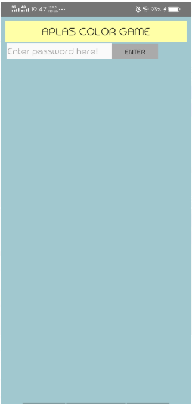

# 04 - Aplas B2

## Tujuan Pembelajaran

1. Mahasiswa mampu membuat game sederhana dari aplas

## Hasil Praktikum

1. Guide 1 (B2X.011 dan B2X.012)

2. Guide  2 (B2X.021)

3. Guide  3 (B2X.031)

4. Guide  4 (B2X.041)

5. Guide  5 (B2X.051)

6. Guide  6 (B2X.061)

7. Guide  7 (B2X.071)

8. Guide  8 (B2X.081)

Hasil

## Pernyataan Diri

Saya menyatakan isi tugas, kode program, dan laporan praktikum ini dibuat oleh saya sendiri. Saya tidak melakukan plagiasi, kecurangan, menyalin/menggandakan milik orang lain.

Jika saya melakukan plagiasi, kecurangan, atau melanggar hak kekayaan intelektual, saya siap untuk mendapat sanksi atau hukuman sesuai peraturan perundang-undangan yang berlaku.

Ttd,

***(Ika Lailatuzzahro)*** 