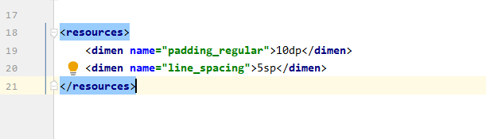
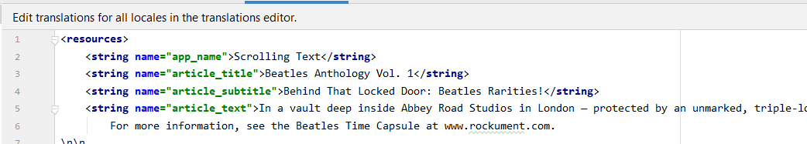
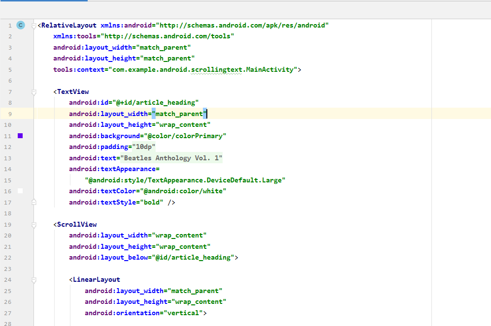
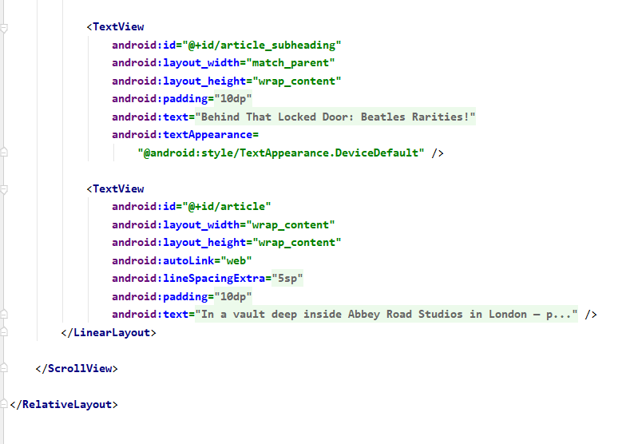
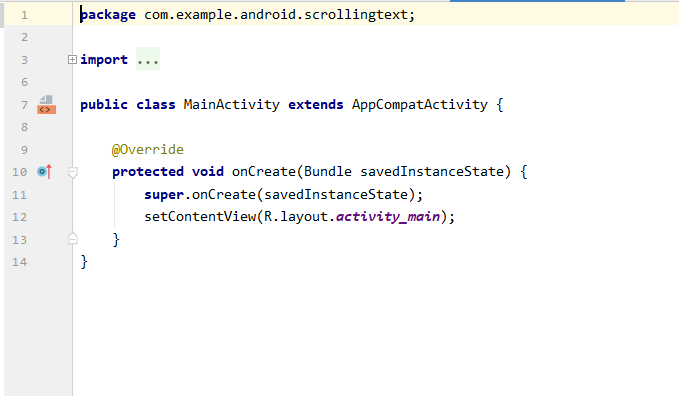
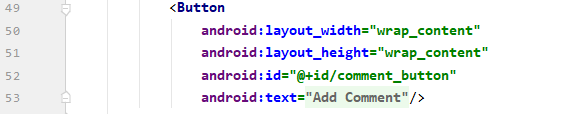
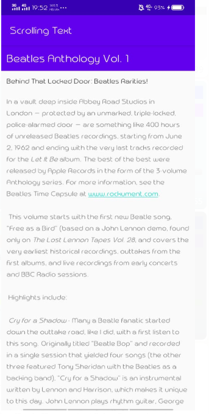
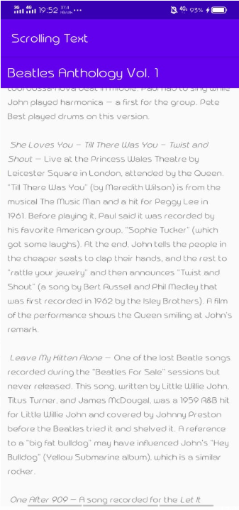
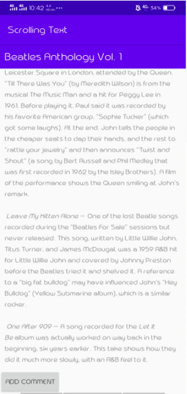

# 05 - ScrollView(ScrollingText)

## Tujuan Pembelajaran

1. Cara menggunakan kode XML untuk menambahkan banyak TextViewelemen.
2. Cara menggunakan kode XML untuk menentukan pengguliran View.
3. Cara menampilkan teks bentuk bebas dengan beberapa tag pemformatan HTML.
4. Bagaimana memberi gaya pada TextViewwarna latar belakang dan warna teks.
5. Bagaimana cara memasukkan tautan web ke dalam teks.

## Source Code

1. dimens.xml

2. string.xml

3. activity_main.xml

4. MainActivity.java

## Challenge

menambah button(Add Comment)

## Hasil Praktikum

## Hasil Challenge

## Pernyataan Diri

Saya menyatakan isi tugas, kode program, dan laporan praktikum ini dibuat oleh saya sendiri. Saya tidak melakukan plagiasi, kecurangan, menyalin/menggandakan milik orang lain.

Jika saya melakukan plagiasi, kecurangan, atau melanggar hak kekayaan intelektual, saya siap untuk mendapat sanksi atau hukuman sesuai peraturan perundang-undangan yang berlaku.

Ttd,

***(Ika Lailatuzzahro)*** 