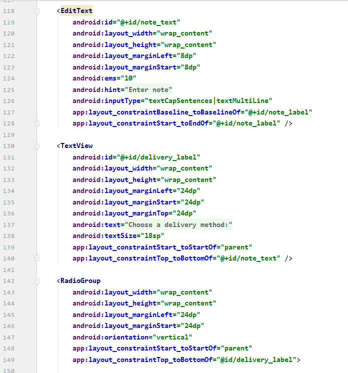

# 06 - InputControl(DroidCafe)

## Tujuan Pembelajaran

1. Cara mengubah metode masukan untuk mengaktifkan saran, kapitalisasi otomatis, dan obfuscation sandi.
2. Cara mengubah keyboard di layar generik menjadi keypad ponsel atau keyboard khusus lainnya.
3. Bagaimana menambahkan tombol radio bagi pengguna untuk memilih satu item dari satu set item.
4. Cara menambahkan spinner untuk menampilkan menu drop-down dengan nilai, dari mana pengguna dapat memilihnya.

## Source Code

1. MainActivity.java

2. OrderActivity.java

3. activity_main.xml

4. activity_order.xml

5. menu_main.xml

## Hasil Praktikum

## Pernyataan Diri

Saya menyatakan isi tugas, kode program, dan laporan praktikum ini dibuat oleh saya sendiri. Saya tidak melakukan plagiasi, kecurangan, menyalin/menggandakan milik orang lain.

Jika saya melakukan plagiasi, kecurangan, atau melanggar hak kekayaan intelektual, saya siap untuk mendapat sanksi atau hukuman sesuai peraturan perundang-undangan yang berlaku.

Ttd,

***(Ika Lailatuzzahro)*** 