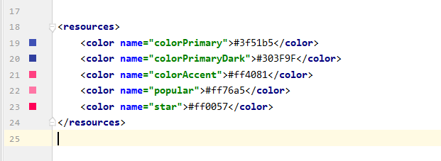
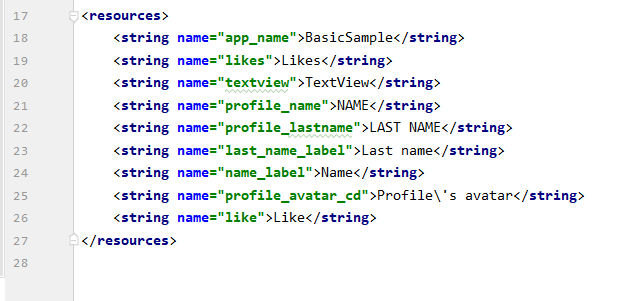
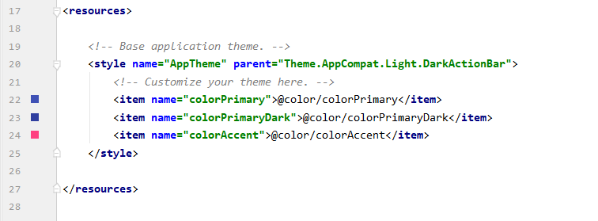

# 07 - DataBinding

## Tujuan Pembelajaran

1. cara membuat tata letak Data Binding.
2. menambahkan variabel dan ekspresi ke dalamnya.
3. menggunakan data yang dapat diamati.
4. membuat tata letak XML lebih bermakna dengan atribut khusus melalui Adapters Binding khusus.
## Source Code

1. colors.xml

2. strings.xml

3. style.xml

## Hasil Praktikum

## Pernyataan Diri

Saya menyatakan isi tugas, kode program, dan laporan praktikum ini dibuat oleh saya sendiri. Saya tidak melakukan plagiasi, kecurangan, menyalin/menggandakan milik orang lain.

Jika saya melakukan plagiasi, kecurangan, atau melanggar hak kekayaan intelektual, saya siap untuk mendapat sanksi atau hukuman sesuai peraturan perundang-undangan yang berlaku.

Ttd,

***(Ika Lailatuzzahro)*** 