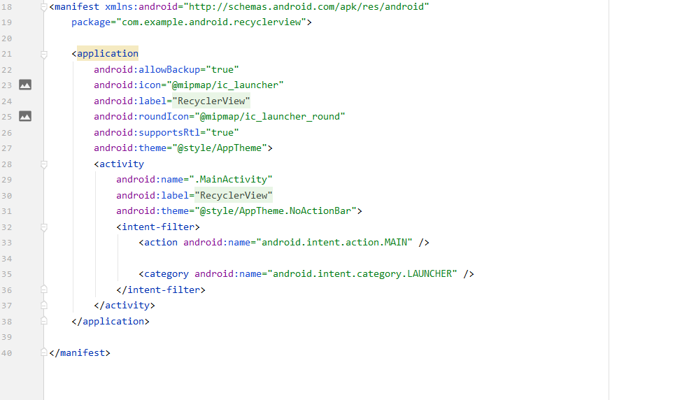

# 11 - (Recyclerview)

## Tujuan Pembelajaran

1. Mahasiswa memahami Recyclerview.
2. Mahasiswa mampu menerapkan Recyclerview pada Android.

## Hasil Praktikum

1. AndroidManifest.xml

2. MainActivity.java

3. Activity_main_xml

4. Hasil Layout(Hasil)

## Pernyataan Diri

Saya menyatakan isi tugas, kode program, dan laporan praktikum ini dibuat oleh saya sendiri. Saya tidak melakukan plagiasi, kecurangan, menyalin/menggandakan milik orang lain.

Jika saya melakukan plagiasi, kecurangan, atau melanggar hak kekayaan intelektual, saya siap untuk mendapat sanksi atau hukuman sesuai peraturan perundang-undangan yang berlaku.

Ttd,

***(Ika Lailatuzzahro)*** 
