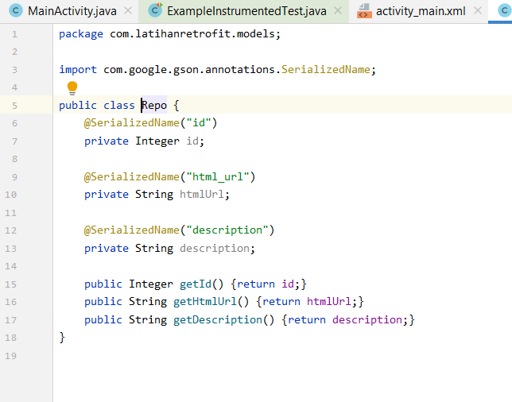

# 12 - Retrofit

## Tujuan Pembelajaran
1. Mahasiswa mampu melakukan Retrofit.

## Hasil Praktikum

1. Source Code

    a. Layout

   

    b. Models

   

    c. MainActivity

   

2. Hasil Layout

     

Pernyataan Diri
Saya menyatakan isi tugas, kode program, dan laporan praktikum ini dibuat oleh saya sendiri. Saya tidak melakukan plagiasi, kecurangan, menyalin/menggandakan milik orang lain.

Jika saya melakukan plagiasi, kecurangan, atau melanggar hak kekayaan intelektual, saya siap untuk mendapat sanksi atau hukuman sesuai peraturan perundang-undangan yang berlaku.

Ttd,

(Ika Lailatuzzahro)