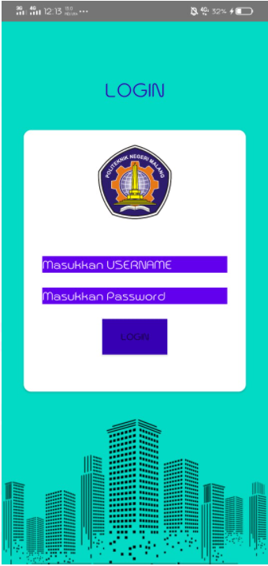
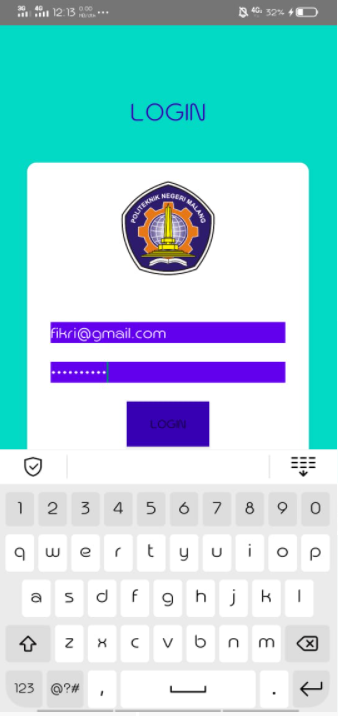
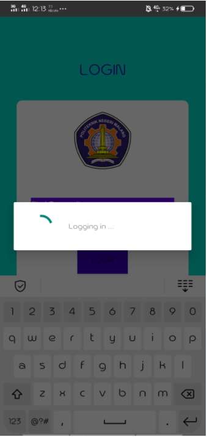
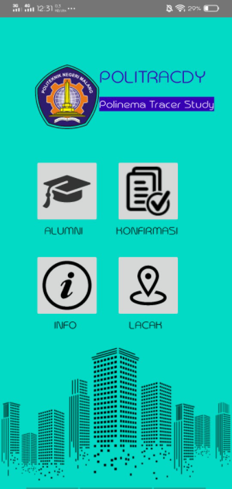
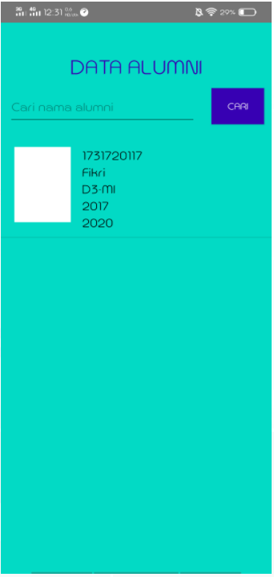
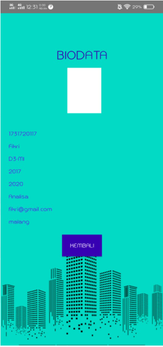
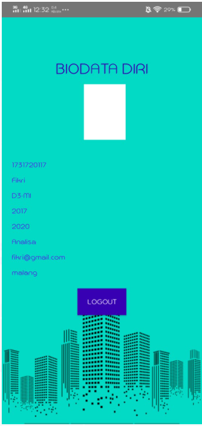
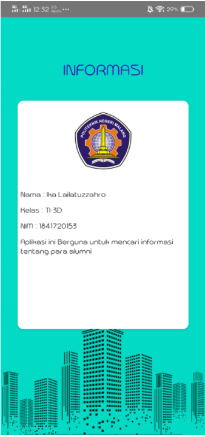

# 13 - PROJECT UKHIR(Tracer Study)

## JUDUL

Judul : Tracer Study

Nama Aplikasi : Politracdy(Polinema Tracer Study)

Bahasa Pemrograman : Java

## DESKRIPSI APLIKASI

Tujuan di buat aplikasi:

1. Memenuhi tugas project akhir mata kuliah pemrograman mobile

2. membantu mahasiswa untuk mempermudah mencari informasi tentang alumni

## IDENTITAS PENGEMBANG (DEVELOPER)

|  |  |
|--|--|
| Nama Lengkap | **Ika Lailatuzzahro** |
| NIM | **1841720153** |
| Absen | **16** |
| Kelas | TI-3D |

## FITUR-FITUR APLIKASI

1. Halaman Login

Ini merupakan halaman login. submit username 
dan password untuk melakukan login ke aplikasi.

2. Logging in

Ini merupakan loading aplikasi untuk mencari data apakah username 
dan password yang dimasukkan sudah tepat.

3. Halaman Utama

Ini merupakan halaman utama. Terdapat 4 fitur di dalamnya

4. Fitur Alumni

Ini merupakan fitur alumni. Yang mana pada fitur ini 
kita bisa mencari data para alumni.

5. Fitur Konfirmasi

Ini merupakan fitur Konfirmasi. Yang mana pada fitur ini
kita bisa meengkonfirmasi apakah data kita telah sesuai.

6. Fitur Lacak

Merupakan fitur yang akan menampilkan maps tempat dimana alumni berada.

7. Fitur Info

Ini merupakan fitur info. Yang mana pada fitur ini
kita bisa melihat informasi tentang aplikasi ini.

## SARAN

Masih ada kesalahan dan bug pada fitur konfirmasi dan Lacak

## KESIMPULAN

Dalam merancang dan membuat aplikasi ini saya belajar cara membuat fragmen,
mengaplikasikan json,menghubungkan database dengan android studio,dan masih banyak lainnya.

## SUMBER DATA Atau REFERENSI

https://developer.android.com/codelabs/advanced-android-training-fragments

https://developer.android.com/codelabs/android-training-asynctask-asynctaskloader

http://www.alwaysdelheru.com/cara-menghubungkan-aplikasi-android-ke-database-mysql/

## Pernyataan Diri

Saya menyatakan isi tugas, kode program, dan laporan praktikum ini dibuat oleh saya sendiri. Saya tidak melakukan plagiasi, kecurangan, menyalin/menggandakan milik orang lain.

Jika saya melakukan plagiasi, kecurangan, atau melanggar hak kekayaan intelektual, saya siap untuk mendapat sanksi atau hukuman sesuai peraturan perundang-undangan yang berlaku.

Ttd,

***(Ika Lailatuzzahro)*** 
